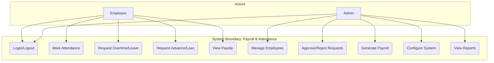
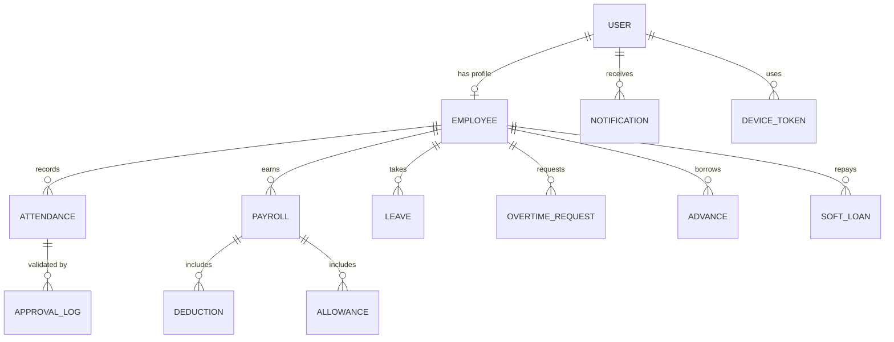
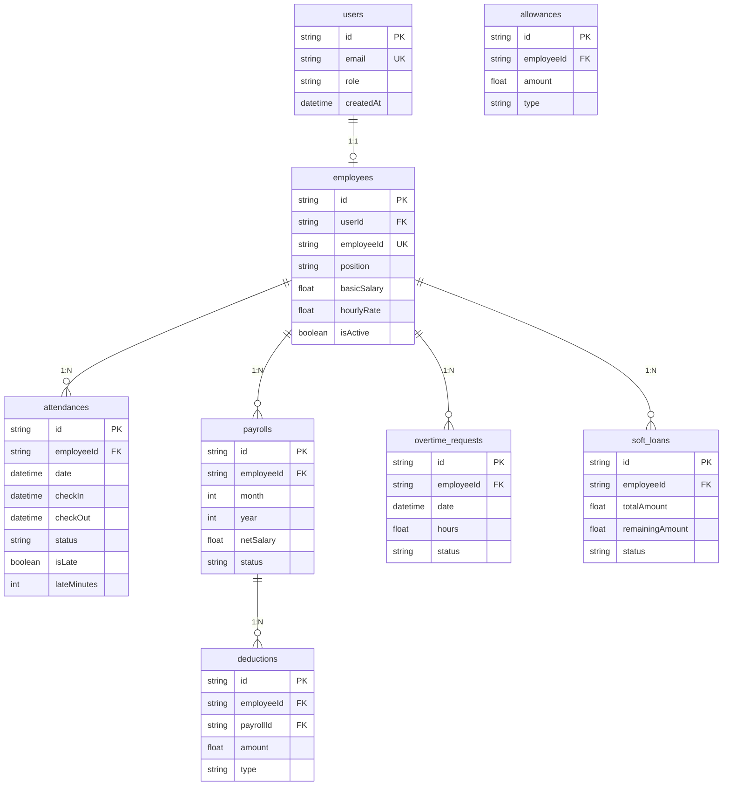
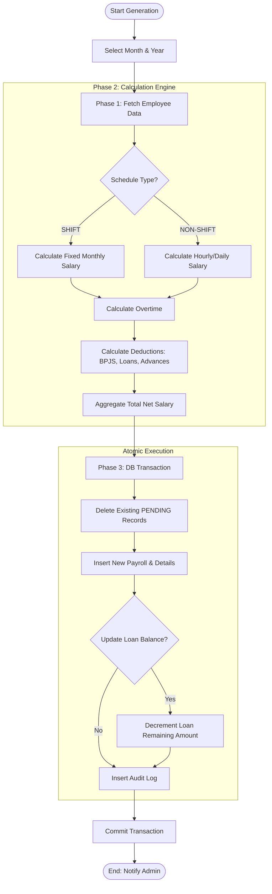
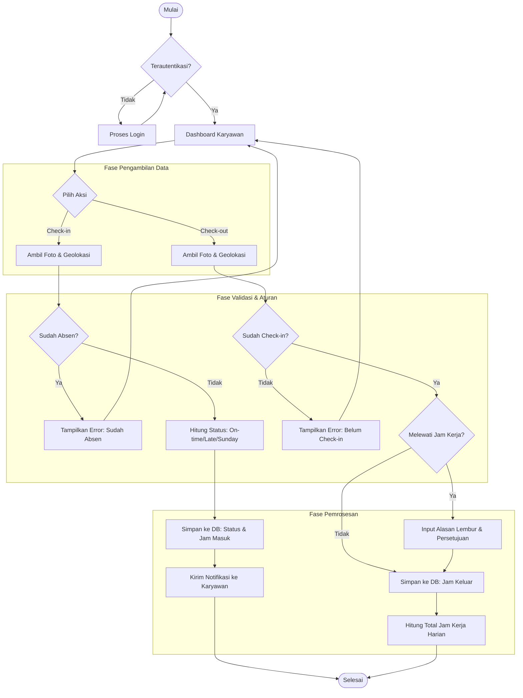

# System Diagrams & Architecture

This document contains the updated diagrams for the Payroll and Attendance System, representing the current implementation and logical structure.

## 1. Use Case Diagram System
Menggambarkan interaksi antara aktor (Admin & Karyawan) dengan fitur-fitur utama sistem.

---

## 2. Entity Relationship Diagram (ERD)
Menunjukkan hubungan antar entitas data dalam sistem secara konseptual.

---

## 3. Logical Record Structure (LRS)
Representasi detail dari skema database, termasuk tipe data, Primary Key (PK), dan Foreign Key (FK).

---

## 4. Activity Diagram (Payroll Generation Process)
Alur kerja proses pembuatan payroll bulanan oleh Admin.

---

## 5. Flowchart (Proses Absensi Harian)
Alur proses absensi harian karyawan (Check-in, Check-out, dan Lembur).

