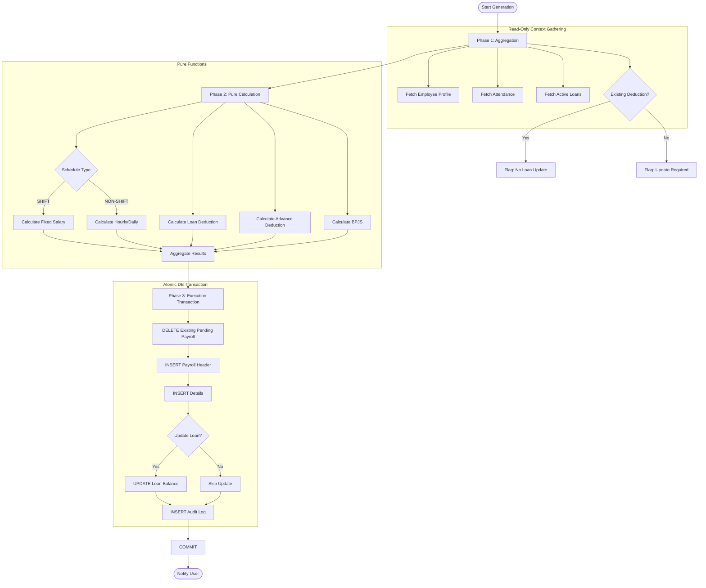

# Payroll System Architecture

## Overview

This document describes the architectural design of the payroll engine implemented in this system. The engine follows a **hybrid payroll model**, supporting two distinct employment types:

* **SHIFT** — Monthly Fixed Salary
* **NON-SHIFT** — Hourly / Daily Based Salary

The core philosophy of the payroll engine is **strict idempotency**, **deterministic computation**, and **functional purity**. Payroll generation is therefore safe to re-run, fully auditable, and resistant to partial failure.

---

## 1. Core Design Principles

### 1.1 Determinism

Given an identical set of inputs (employee configuration, attendance records, overtime requests, and financial obligations), the payroll engine must always produce an identical output. No hidden state, implicit mutation, or timing dependency is allowed to influence the result.

### 1.2 Retry-Safety (Idempotency)

Payroll generation is a high-risk financial operation. The system is explicitly designed to allow payroll generation for the same Employee and Period (Month/Year) to be executed multiple times without causing:

* Duplicate payroll records
* Double deductions
* Inconsistent loan balances

### 1.3 Atomicity

Payroll generation is finalized atomically. Either all payroll-related records (header, allowances, deductions, and balance updates) are committed together, or none are committed at all. Partial or inconsistent financial states are structurally impossible.

---

## 2. Architectural Phases

The payroll engine is divided into three clearly separated phases: **Aggregation**, **Calculation**, and **Execution**.

### Phase 1: Data Aggregation (Read-Only)

This phase gathers all contextual data required for payroll computation. No business logic or mutation occurs at this stage.

**Aggregated Data Sources:**

* **Employee Profile** — Salary configuration, hourly rate, position, and work schedule type.
* **Attendance Records** — Clock-in / clock-out data and attendance status filtered strictly by the payroll period.
* **Overtime Requests** — Only `APPROVED` overtime within the target month.
* **Financial Obligations**

  * **Advances (Kasbon)** — Approved advances scheduled for deduction in the current period.
  * **Soft Loans** — Active loans with remaining balances.
* **Historical Context (Idempotency Check)** — Existing deduction records for the same Employee + Period, used to detect prior successful deductions.

---

### Phase 2: Calculation Engine (Pure Functional Core)

All payroll business rules are implemented as **pure functions**. These functions operate exclusively on in-memory data and return deterministic results.

They **must not**:

* Query the database
* Perform writes
* Depend on global or mutable state

**Calculation Responsibilities:**

* **Shift Salary Calculator** — Fixed monthly salary minus penalties (lateness, absence).
* **Non-Shift Salary Calculator** — Standard workdays × 8 hours × hourly rate, plus attendance-based allowances.
* **Overtime Calculator** — Tiered overtime rates based on workday / holiday rules.
* **Deduction Calculators**

  * **Soft Loan Deduction** — Monthly installment or remaining balance, respecting idempotency signals.
  * **Advance Deduction** — Sum of advances scheduled for the current period.
* **Statutory Deductions** — BPJS deductions based on employee configuration.

**Invariant:**

```
Calculation(Input) → Output
```

No side effects are permitted.

---

### Phase 3: Execution Layer (Transactional Side Effects)

The execution layer applies calculation results to persistent storage within a **single ACID database transaction**.

**Execution Steps:**

1. **Cleanup** — Remove all existing *PENDING* payroll records (header, allowances, deductions) for the Employee and Period.
2. **Persist** — Insert new payroll records based on the calculation output.
3. **State Mutation** — Update loan balances and advance statuses only when explicitly required.
4. **Audit Logging** — Record a snapshot of the calculation results for traceability.

If any step fails, the transaction is rolled back entirely.

---

## 3. Idempotency Strategy

### 3.1 Soft Loan Deductions

**Problem:** Re-running payroll must not reduce loan principal multiple times.

**Strategy:**

1. During aggregation, the system checks for an existing `PINJAMAN` deduction for the same `(LoanID, Month, Year)`.
2. If an existing deduction is found:

   * The original deduction amount is reused.
   * No loan balance update is scheduled.
3. If no deduction exists:

   * A new installment is calculated.
   * The loan balance is reduced within the transaction.

This guarantees that each loan is deducted **at most once per period**.

---

### 3.2 Advance (Kasbon) Deductions

**Problem:** Advances are one-time deductions, but payroll retries must remain consistent.

**Strategy:**

* Advances are selected strictly by `DeductionMonth` and `DeductionYear`.
* Mutable flags such as `deductedAt` are intentionally ignored during selection.
* Cleanup + regeneration ensures the same advances are always rediscovered for the same period.

This ensures stable and repeatable deduction behavior.

---

## 4. Payroll Lifecycle

1. **Generation (Draft)**

   * Triggered by Admin/System
   * Status: `PENDING`
   * Payroll can be regenerated safely at this stage

2. **Review**

   * HR/Finance validates calculations
   * Source data may be corrected and payroll regenerated

3. **Finalization (Payment)**

   * Triggered via `markPayrollAsPaid`
   * Status changes to `PAID`
   * Record becomes immutable

---

## 5. System Guarantees

| Aspect           | Guarantee                                          |
| ---------------- | -------------------------------------------------- |
| Re-run Safety    | Unlimited retries for the same period are safe     |
| Loan Integrity   | Loan balances are reduced exactly once per period  |
| Data Consistency | Payroll header and details are always synchronized |

---

## 6. Process Flow Diagram



---

## Non-Goals

The following concerns are explicitly out of scope for this payroll engine:

* Income tax (PPH 21) calculation
* Accounting journal generation
* Validation of attendance data correctness

These responsibilities belong to separate systems or manual review processes.
